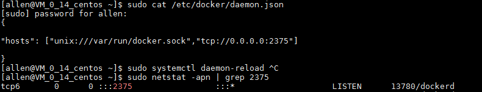

# 使用*dockerfile-maven-plugin*构建docker镜像，并push到dockerhub或private registry
**Note** 目前主流的
## 1 请确保开启docker远程API,一般可通过修改`/etc/docker/daemon.json`来完成,修改完成后执行`systemctl daemon-reload`重新加载配置.



> Note: 
 * 在docker所在主机上执行`netstat -anp|grep 2375 `显示有监听即可
 * 然后在当前主机上执行`curl DOCKER_HOST:2375/info`,可显示相关信息即可,`DOCKER_HOST`为docker所在服务器IP

## 2 我们需要连接远程的docker,所以需要配置环境变量,默认情况下是localhost:2375
* 环境变量名称:DOCKER_HOST
* 值:IP:Port
> 如下图所示,**记得配置完环境变量一定要重启STS,否则环境变量不会生效**


## 3 构建一个基本的*spring-boot*项目,我使用的是STS,项目结构如下:


## 4 引入*dockerfile-maven-plugin*依赖
```
<properties>
    <docker.image.prefix>dockerlgf</docker.image.prefix>
    <com.spotify.version>1.4.4</com.spotify.version>
</properties>
<plugin>
    <groupId>com.spotify</groupId>
    <artifactId>dockerfile-maven-plugin</artifactId>
    <version>${com.spotify.version}</version> 
    <configuration>
        <repository>${docker.image.prefix}/${project.artifactId}</repository> <1>
        <tag>${project.version}</tag> <2>
        <buildArgs>
            <JAR_FILE>target/${project.build.finalName}.jar</JAR_FILE> <3>
        </buildArgs>
    </configuration>
</plugin>
```
* <1>处的docker.image.prefix一般配置的是private registry或者自己的dockerhub仓库地址
* <2>处配置的是build的image的tag
* <3>处配置了一个参数和所对应的jar位置,在根据Dockerfile构建image会用到,下文会看到

## 5 编写一个简单的Dockerfile
```
FROM openjdk:8-jdk-alpine
VOLUME /tmp
ARG JAR_FILE <1>
COPY ${JAR_FILE} app.jar
ENTRYPOINT ["java","-Djava.security.egd=file:/dev/./urandom","-jar","/app.jar"]
```
* <1>处的参数来源于第4部分中的<3>

## 6 运行`mvn clean install dockerfile:build`构建一个镜像 
* 控制台输出如下

```
[INFO] --- dockerfile-maven-plugin:1.4.4:build (default-cli) @ spring-boot-docker ---
[INFO] Building Docker context C:\Users\meng\git\spring-boot-demo\spring-boot-docker
[INFO] 
[INFO] Image will be built as dockerlgf/spring-boot-docker:0.0.1-SNAPSHOT
[INFO] 
[INFO] Step 1/5 : FROM openjdk:8-jdk-alpine
[INFO] 
[INFO] Pulling from library/openjdk
[INFO] Digest: sha256:1fd5a77d82536c88486e526da26ae79b6cd8a14006eb3da3a25eb8d2d682ccd6
[INFO] Status: Image is up to date for openjdk:8-jdk-alpine
[INFO]  ---> 5801f7d008e5
[INFO] Step 2/5 : VOLUME /tmp
[INFO] 
[INFO]  ---> Using cache
[INFO]  ---> b90c1c24eb70
[INFO] Step 3/5 : ARG JAR_FILE
[INFO] 
[INFO]  ---> Using cache
[INFO]  ---> 2eb471077ea7
[INFO] Step 4/5 : COPY ${JAR_FILE} app.jar
[INFO] 
[INFO]  ---> 89af465e0dc9
[INFO] Step 5/5 : ENTRYPOINT ["java","-Djava.security.egd=file:/dev/./urandom","-jar","/app.jar"]
[INFO] 
[INFO]  ---> Running in fe0870ebc030
[INFO] Removing intermediate container fe0870ebc030
[INFO]  ---> 5b543bc94641
[INFO] Successfully built 5b543bc94641
[INFO] Successfully tagged dockerlgf/spring-boot-docker:0.0.1-SNAPSHOT
[INFO] 
[INFO] Detected build of image with id 5b543bc94641
[INFO] Building jar: C:\Users\meng\git\spring-boot-demo\spring-boot-docker\target\spring-boot-docker-0.0.1-SNAPSHOT-docker-info.jar
[INFO] Successfully built dockerlgf/spring-boot-docker:0.0.1-SNAPSHOT
[INFO] ------------------------------------------------------------------------
[INFO] BUILD SUCCESS
```
* 在docker服务器使用docker命令看到构建好的镜像如下


## 7 配置Maven命令默认执行dockerfile命令
> 对应关系如下图所示


```
<plugin>
  <groupId>com.spotify</groupId>
  <artifactId>dockerfile-maven-plugin</artifactId>
  <version>${dockerfile-maven-version}</version>
  <executions>
    <execution>
      <id>default</id>
      <goals>
        <goal>build</goal>
        <goal>push</goal>
      </goals>
    </execution>
  </executions>
  <configuration>
    <repository>${docker.image.prefix}/${project.artifactId}</repository>
    <tag>${project.version}</tag>
    <buildArgs>
      <JAR_FILE>${project.build.finalName}.jar</JAR_FILE>
    </buildArgs>
  </configuration>
</plugin>
```

> 结合上图和上面的配置,说明如下
    * mvn package \=\= mvn package + dockerfile:build
    * mvn deploy  \=\= mvn dockerfile:push + deploy 
## 8 push镜像到dockerhub或private registry
> 官网讲到有两种方式
* **Authenticating with maven pom.xml**:从1.3.XX版本以后,至此在`pom.xml`中直接配置`username`和`password`来完成push到dockerhub或者private registry,或者在命令行执行时指定`mvn goal -Ddockerfile.username=... -Ddockerfile.password=...`

```
 <build>
    <plugins>
        <plugin>
            <groupId>com.spotify</groupId>
            <artifactId>dockerfile-maven-plugin</artifactId>
            <version>${com.spotify.version}</version>
            <configuration>
                <username>dockerlgf</username> <1>
                <password>xxxxxx</password> <2>
                <useMavenSettingsForAuth>true</useMavenSettingsForAuth>
                <repository>${docker.image.prefix}/${project.artifactId}</repository>
                <tag>${project.version}</tag>
                <buildArgs>
                    <JAR_FILE>target/${project.build.finalName}.jar</JAR_FILE>
                </buildArgs>
            </configuration>
        </plugin>
    </plugins>
</build>
```
  * <1>处配置dockerhub或者private registry账号
  * <2>处配置dockerhub或者private registry密码

* **Authenticating with maven settings.xml**:从1.3.6版本以后,可以通过在maven settings.xml配置server信息,pom.xml只需要添加下面的配置

> pom.xml

```
<configuration>
  <repository>docker-repo.example.com:8080/organization/image</repository>
  <tag>latest</tag>
  <useMavenSettingsForAuth>true</useMavenSettingsForAuth>
</configuration>
```

> maven settings.xml

```
<servers>
  <server>
    <id>docker-repo.example.com:8080</id>
    <username>me</username>
    <password>mypassword</password>
  </server>
</servers>
```
* 我只测试成功了一种方式,配置如上

## 9 执行mvn命令时跳过绑定在maven命令上的dockerfile相关命令


## 10 参考文章
* [Spring Boot with Docker](https://spring.io/guides/gs/spring-boot-docker/)
* [dockerfile-maven-plugin官网](https://github.com/spotify/dockerfile-maven)
* [https://blog.csdn.net/lvyuan1234/article/details/69255944](https://blog.csdn.net/lvyuan1234/article/details/69255944)
* [https://segmentfault.com/a/1190000010313412](https://segmentfault.com/a/1190000010313412)
