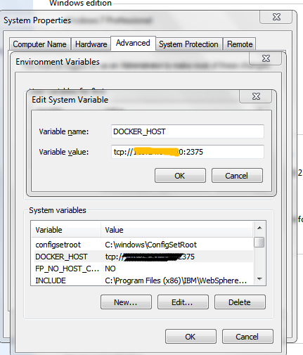

# 使用*dockerfile-maven-plugin*将本地项目构建成远程的docker镜像，并push到dockerhub或private registry
## 1 请确保开启docker远程API,一般可通过修改`/etc/docker/daemon.json`来完成,修改完成后执行`systemctl daemon-reload`重新加载配置.


> Note: 
 * 在docker所在主机上执行`netstat -anp|grep 2375 `显示有监听即可
 * 然后任意主机上执行`curl 127.0.0.1:2375/info`,可显示相关信息即可

## 2 因为我们不是使用本地的docker,需要配置环境变量,默认情况下是localhost:2375
* 环境变量名称:DOCKER_HOST
* 值:ip:port
> 如下图所示



## 3 构建一个基本的*spring-boot*项目,我使用的是STS,项目结构如下:


## 4 引入*dockerfile-maven-plugin*依赖
```java
    <properties>
        <docker.image.prefix>dockerlgf</docker.image.prefix>
    </properties>
    <!-- https://github.com/spotify/dockerfile-maven  -->
    <plugin>
        <groupId>com.spotify</groupId>
        <artifactId>dockerfile-maven-plugin</artifactId>
        <version>1.3.6</version>
        <configuration>
            <repository>${docker.image.prefix}/${project.artifactId}</repository>
            <buildArgs>
                <JAR_FILE>target/${project.build.finalName}.jar</JAR_FILE>
            </buildArgs>
        </configuration>
    </plugin>
```
## 5 参考文章
* [https://blog.csdn.net/lvyuan1234/article/details/69255944](https://blog.csdn.net/lvyuan1234/article/details/69255944)
* [https://segmentfault.com/a/1190000010313412](https://segmentfault.com/a/1190000010313412)
* [https://segmentfault.com/a/1190000010313412](https://segmentfault.com/a/1190000010313412)