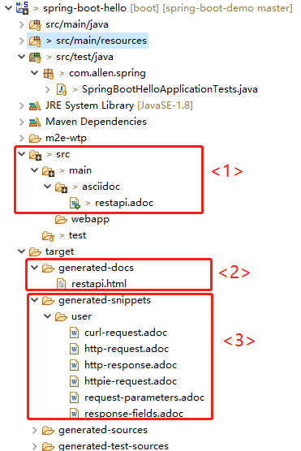
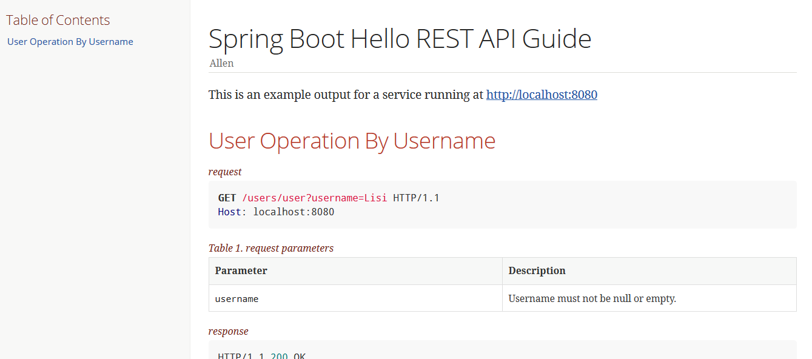
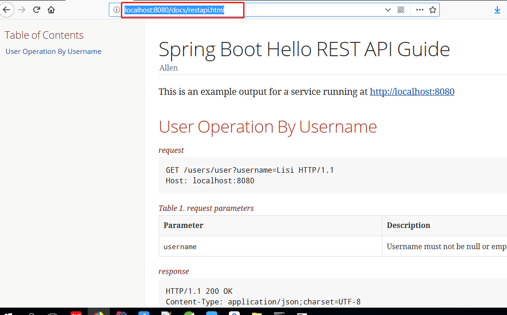

# Spring Boot 
> 这个demo主要包括三部分:自定义配置文件,禁用特定的自动配置项,Spring Rest Docs

**首先,新建一个spring boot项目**

## 1 使用java bean自定义配置文件
### 1.1 新建一个java bean,添加`@Component`和`@ConfigurationProperties(prefix = "person")`
```
@Component
@ConfigurationProperties(prefix = "person")
public class Person {

    private String name;
    private Integer age;
    ...
    }
```

### 1.2 application.yml配置属性值
```
person: 
  name: lisi
```

### 1.3 在controller中获取application.yml中配置的属性值
```
@RestController
public class HelloController {

    
    @Autowired
    private Person person;
    
    @GetMapping(path="/hello")
    public String hello() {
        return person.getName();
    }
}
```
### 1.4 访问`http://localhost:8080`就可以看到配置是否生效

## 2 禁用特定的自动配置项
### 2.1 方法一：在主类的*@SpringBootApplication*加上exclude属性,比如去掉*DataSourceAutoConfiguration*和*HibernateJpaAutoConfiguration*
```
@SpringBootApplication(exclude = { DataSourceAutoConfiguration.class ,HibernateJpaAutoConfiguration.class})
public class SpringBootHelloApplication {
    
    public static void main(String[] args) {
        SpringApplication.run(SpringBootHelloApplication.class, args);
    }
}
```
### 2.2 方法二：在application.yml或者application.properties添加如下配置
```
spring.autoconfigure.exclude[0]=org.springframework.boot.autoconfigure.jdbc.DataSourceAutoConfiguration
spring.autoconfigure.exclude[1]=org.springframework.boot.autoconfigure.orm.jpa.HibernateJpaAutoConfiguration
```

## 3 Spring Rest Docs

### 3.1 添加依赖和插件
```
<!-- mockmvc --> <1>
<dependencies>
	<dependency>
	    <groupId>org.springframework.restdocs</groupId>
	    <artifactId>spring-restdocs-mockmvc</artifactId>
	    <scope>test</scope>
	</dependency>
</dependencies>

<build>
	<plugins>
		<!-- asciidoc plugin:将.adoc文件转化成html --> <2>
		<plugin>
			<groupId>org.asciidoctor</groupId>
			<artifactId>asciidoctor-maven-plugin</artifactId>
			<version>1.5.3</version>
			<executions>
				<execution>
					<id>generate-docs</id>
					<phase>prepare-package</phase>
					<goals>
						<goal>process-asciidoc</goal>
					</goals>
					<configuration>
						<backend>html</backend>
						<doctype>book</doctype>
					</configuration>
				</execution>
			</executions>
			<dependencies>
				<dependency>
					<groupId>org.springframework.restdocs</groupId>
					<artifactId>spring-restdocs-asciidoctor</artifactId>
					<version>1.2.0.RELEASE</version>
				</dependency>
			</dependencies>
		</plugin>
	</plugins>
</build>
```

* <1> 处添加的依赖目的是使用MockMvc对Restful接口进行测试 
* <2> 处添加的插件可以将.adoc文件转化成html,将`process-asciidoc`命令绑定到maven命令`prepare-package`

### 3.2 写一个简单的controller
```
@RestController
@RequestMapping(path="/users")
public class UserController {

	@GetMapping(path="user")
	public User getUserByUsername(@RequestParam(value="username")String username) {
		User user = new User();
		user.setUsername(username);
		user.setPassword("xxxxxx");
		user.setAge(25);
		user.setGender("男");
		return user;
	}
}
```

### 3.3 编写junit测试
```
@RunWith(SpringRunner.class)
@WebMvcTest(UserController.class) <1>
@AutoConfigureRestDocs(outputDir = "target/generated-snippets") <1>
public class SpringBootHelloApplicationTests {

	@Autowired
	private MockMvc mockMvc;

	@Test <3>
	public void testFindUserByUsername() throws Exception { 
		this.mockMvc.perform(get("/users/user?username=Lisi"))
					.andDo(print())
					.andExpect(status().isOk())
					.andDo(document("user" ,
							requestParameters(parameterWithName("username").description("Username must not be null or empty.")),
							responseFields(
									fieldWithPath("username").description("Uername"),
									fieldWithPath("password").description("Password"),
									fieldWithPath("age").description("Age"),
									fieldWithPath("gender").description("Gender"))));
	}

}
```

* <1>加载要Mock的Controller
* <2>指定RestDocs生成的文件的位置
* <3>对3.2中的restful api进行mock测试，并将请求参数和返回值写入到mock文件中

### 3.4 在项目的`src/main/asciidoc`(默认情况下`asciidoctor-maven-plugin`会在该目录下扫描.adoc格式的文件) 目录下新建一个`.adoc`格式的文件
```
= Spring Boot Hello REST API Guide
Allen;
:doctype: book
:icons: font
:source-highlighter: highlightjs
:toc: left
:toclevels: 4

This is an example output for a service running at http://localhost:8080

[Search-User-By-Username]
== User Operation By Username

.request
include::{snippets}/user/http-request.adoc[]

.request parameters
include::{snippets}/user/request-parameters.adoc[]

.response
include::{snippets}/user/http-response.adoc[]

.response fields
include::{snippets}/user/response-fields.adoc[]
```

### 3.5 运行maven命令`mvc clean prepare-package`
* Mock生成的测试文件如下所示
	* <1> .adoc文件
	* <2> .adoc文件转化的.html
	* <3> .MockMVC生成的测试文件

* .adoc转化成的html文件如下


### 3.6 将默认生成的`target/generated-docs`下`restapi.html`更改为`src/main/resources/static/docs/restapi.html`.当每次启动spring boot时，直接访问`http://localhost:8080/docs/restapi.html`就可以看到新生成的html
```
<build>
	<plugins>
		<plugin>
			<artifactId>maven-resources-plugin</artifactId>
			<executions>
				<execution>
					<id>copy-resources</id>
					<phase>prepare-package</phase>
					<goals>
						<goal>copy-resources</goal>
					</goals>
					<configuration>
						<outputDirectory>
							${project.build.outputDirectory}/static/docs
						</outputDirectory>
						<resources>
							<resource>
								<directory>
									${project.build.directory}/generated-docs
								</directory>
							</resource>
						</resources>
					</configuration>
				</execution>
			</executions>
		</plugin>
	</plugins>
</build>
```

