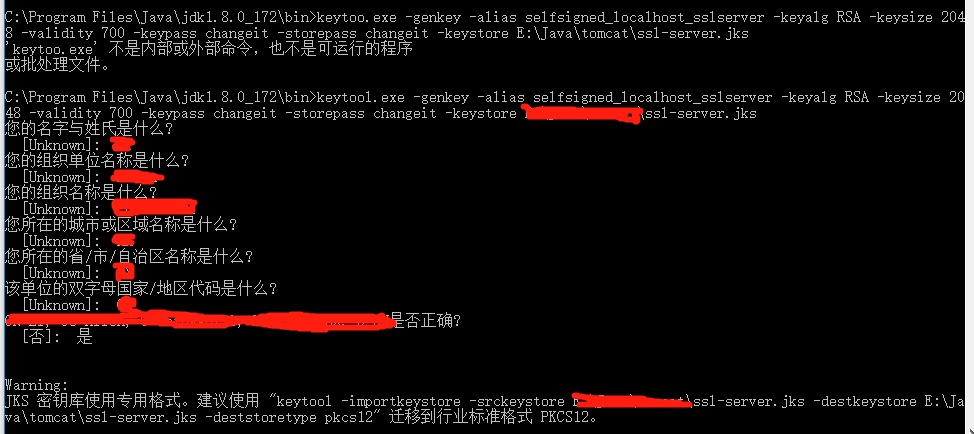
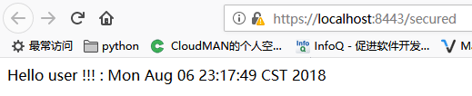

# Spring Boot 内嵌Tomcat配置SSL(HTTPS)

## 1 使用JDK keytool.exe运行下面的命令 
```cmd
keytool.exe -genkey -alias selfsigned_localhost_sslserver -keyalg RSA -keysize 2048 -validity 700 -keypass changeit -storepass changeit -keystore ssl-server.jks
```
> 生成 步骤如下图所示


## 2 将生成的ssl-server.jks放到项目的`src/main/resources`下，配置application.properties
```properties
server.port=8443
server.ssl.key-alias=selfsigned_localhost_sslserver
server.ssl.key-password=changeit
server.ssl.key-store=classpath:ssl-server.jks
server.ssl.key-store-provider=SUN
server.ssl.key-store-type=JKS
```

## 3 添加一个简单的controller , 启动springboot
> 访问url：[https://localhost:8443/secured](https://localhost:8443/secured)
> 可以看到如下效果



## 4 配置从HTTP跳转到HTTPS,添加一个配置类,加入如下代码
```java
@Configuration
public class HttpsConfig {

    @Bean
    public EmbeddedServletContainerFactory servletContainer() {
        TomcatEmbeddedServletContainerFactory tomcat = new TomcatEmbeddedServletContainerFactory() {
            @Override
            protected void postProcessContext(Context context) {
                SecurityConstraint securityConstraint = new SecurityConstraint();
                securityConstraint.setUserConstraint("CONFIDENTIAL");
                SecurityCollection collection = new SecurityCollection();
                collection.addPattern("/*");
                securityConstraint.addCollection(collection);
                context.addConstraint(securityConstraint);
            }
        };
        tomcat.addAdditionalTomcatConnectors(redirectConnector());
        return tomcat;
    }

    private Connector redirectConnector() {
        Connector connector = new Connector("org.apache.coyote.http11.Http11NioProtocol");
        connector.setScheme("http");
        connector.setPort(8080);
        connector.setSecure(false);
        connector.setRedirectPort(8443);
        return connector;
    }
}
```
> 此时，当你在访问[http://localhost:8080/secured](http://localhost:8080/secured)就会直接跳转
> 到[https://localhost:8443/secured](https://localhost:8443/secured)

## 5 参考文档
* [https://howtodoinjava.com/spring-boot/spring-boot-ssl-https-example/](https://howtodoinjava.com/spring-boot/spring-boot-ssl-https-example/)
* [Spring Boot Secured By Let's Encrypt](https://dzone.com/articles/spring-boot-secured-by-lets-encrypt)

