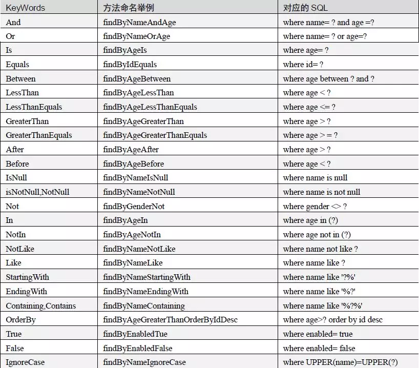

# Spring boot with Spring Data JPA

> 该例展示了SpringBoot集成Spring Data JPA
## 1. 新建一个Spring Boot项目，引入`spring-boot-starter-data-jpa`和`mysql-connector-java`相关依赖,如下图所示
> - 该项目是`spring-boot-parent`的一个子模块，下面依赖的版本号已在`spring-boot-parent`中声明
> - 因为oracle驱动的版权问题，集成oracle的jar包我放在了项目的lib目录下，依赖如下
> - mysql或者oracle依赖引入其一即可
```xml
<!-- Spring Data JPA -->
<dependency>
    <groupId>org.springframework.boot</groupId>
    <artifactId>spring-boot-starter-data-jpa</artifactId>
</dependency>

<!-- mysql driver -->
<dependency>
    <groupId>mysql</groupId>
    <artifactId>mysql-connector-java</artifactId>
</dependency>

<!-- oracle driver -->
<dependency>
    <groupId>ojdbc6</groupId>
    <artifactId>ojdbc6</artifactId>
    <version>11.2.0.4</version>
    <scope>system</scope>
    <systemPath>${basedir}/lib/ojdbc6.jar</systemPath>
</dependency>

```
## 2. application.properties引入数据库相关配置
```properties
# Oracle DateSource
spring.datasource.driver-class-name=dao.jdbc.OracleDriver
spring.datasource.url=jdbc:dao:thin:@localhost:1521:XE
spring.datasource.username=allen
spring.datasource.password=password
spring.jpa.database-platform=org.hibernate.dialect.Oracle10gDialect

# MYSQL DataSource
spring.datasource.driver-class-name=com.mysql.cj.jdbc.Driver
spring.datasource.username=root
spring.datasource.password=password
spring.datasource.url=jdbc:mysql://localhost:3306/allen
spring.jpa.database-platform=org.hibernate.dialect.MySQL8Dialect

# sql message
spring.jpa.show-sql=true
spring.jpa.format-sql=true

# ddl-auto strategy: create-drop exectue initialized sql
spring.jpa.hibernate.ddl-auto=create-drop
```

## 3. 主类添加@EnableJpaRepositories
```java
@SpringBootApplication
@EnableJpaRepositories
public class SpringBootJpaApplication {

    public static void main(String[] args) {
        SpringApplication.run(SpringBootJpaApplication.class, args);
    }
}
```
## 4. 声明一个Repository,根据JPA规则写方法
```java
public interface UserRepository extends UserCustom, JpaRepository<UserPO, Long> {

    Optional<UserPO> findById(Long id);
}
``` 

## 5. JPA 支持的关键字


## 6. 查询方式流程解析(参考自公众号牧马小子)
- 为什么写上方法名，JPA就知道你想干嘛了呢？假如创建如下的查询： findByUserDepUuid()，框架在解析该方法时，首先剔除 findBy，然后对剩下的属性进行解析，假设查询实体为Doc：
- 先判断 userDepUuid （根据 POJO 规范，首字母变为小写）是否为查询实体的一个属性，如果是，则表示根据该属性进行查询；如果没有该属性，继续第二步；
- 从右往左截取第一个大写字母开头的字符串(此处为Uuid)，然后检查剩下的字符串是否为查询实体的一个属性，如果是，则表示根据该属性进行查询；如果没有该属性，则重复第二步，继续从右往左截取；最后假设 user 为查询实体的一个属性；
- 接着处理剩下部分（DepUuid），先判断 user 所对应的类型是否有depUuid属性，如果有，则表示该方法最终是根据 “ Doc.user.depUuid” 的取值进行查询；否则继续按照步骤 2 的规则从右往左截取，最终表示根据 “Doc.user.dep.uuid” 的值进行查询。
- 可能会存在一种特殊情况，比如 Doc包含一个 user 的属性，也有一个 userDep 属性，此时会存在混淆。可以明确在属性之间加上 "" 以显式表达意图，比如 "findByUserDepUuid()" 或者 "findByUserDep_uuid()"
- 还有一些特殊的参数：例如分页或排序的参数：

## 参考资料
- [https://mp.weixin.qq.com/s/Fg5ssXuvabZwEfRMKfpY9Q](https://mp.weixin.qq.com/s/Fg5ssXuvabZwEfRMKfpY9Q)