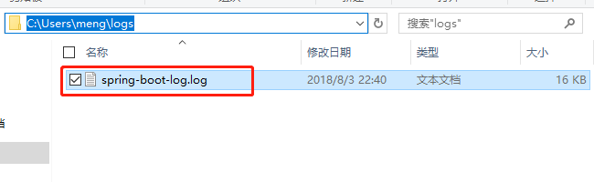

# *Spring Boot* 日志框架
> *Spring Boot* 内部采用的是 *Commons Logging* 进行日志记录，但在底层为 *Java Util Logging*、
> *Log4J2*、*Logback* 等日志框架提供了默认配置 。

## 1.1 *Spring Boot* 默认日志框架*Java Util Logging*
可在applicaiton.yml/application.properties中进行配置，如下所示列举了一些常用的配置
> 日志级别:ERROR、WARN、INFO、DEBUG、TRACE

        # 配置log level
        logging.level.root = WARN
        # 配置自定义包下的日志级别(com.allen.spring.controller) 
        logging.level.com.allen.spring.controller = DEBUG
        # 默认情况下，日志只会输出到控制台中;指定日志输出文件 ，但此时日志依然会打印到控制台 
        logging.file=${user.home}/logs/spring-boot-log.log
        # 限制日志文件大小
        logging.file.max-size=10MB
		# 限制日志文件保留天数
		logging.file.max-history=10
        
> 输出的日志文件如下图所示 

## 1.2 *Spring Boot* 集成*Log4j2* 框架
> 首先在pom.xml引入如下依赖 (Note:去掉spring-boot-starter-logging的依赖，否则会启动失败)

		<dependency>
			<groupId>org.springframework.boot</groupId>
			<artifactId>spring-boot-starter-web</artifactId>
			<exclusions>
				<exclusion>
					<groupId>org.springframework.boot</groupId>
					<artifactId>spring-boot-starter-logging</artifactId>
				</exclusion>
			</exclusions>
		</dependency>
		<dependency>
			<groupId>org.springframework.boot</groupId>
			<artifactId>spring-boot-starter-log4j2</artifactId>
		</dependency>
		
> 在src/main/resources下引入log4j2.xml

        

