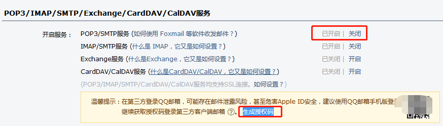

# Spring Boot integration mail

## 1 在`pom.xml`中添加`mail-starter`
```xml
<dependency>
    <groupId>org.springframework.boot</groupId>
    <artifactId>spring-boot-starter-mail</artifactId>
</dependency>
```

## 2 在application.perperties加入如下配置
```properties
# mail server
spring.mail.host=smtp.qq.com
# mail username
spring.mail.username=xxxxxx@qq.com
# mail auth token
spring.mail.password=xxxxxx
spring.mail.default-encoding=UTF-8
spring.mail.port=465
spring.mail.properties.mail.smtp.socketFactory.class=javax.net.ssl.SSLSocketFactory
spring.mail.properties.mail.debug=true
        
```
> 其中,qq邮箱的密码对应qq邮箱生成的授权码,如下图所示



> 在浏览器获取授权码的流程:`开始`--\>`登录qq邮箱`--\>`设置`--\>`账户`--\>`POP3/IMAP/SMTP/Exchange/CardDAV/CalDAV服务`--\>` 生成授权码 `--\>`获得授权码`--\>`结束`

## 3 在MailControllerImpl写了3个简单的restful接口
> 注意:下面的请求路径是针对通过spring-boot内嵌tomcat启动时
### 3.1 简单的邮件发送功能接口如下：
* url [http://localhost:8080/simpleMail](http://localhost:8080/simpleMail)
* Method POST
* RequestBody
> 注意:*mailName*需要满足`RFC 5322`,符合正则表达式("^[a-zA-Z0-9_!#$%&’*+/=?`{|}~^.-]+@[a-zA-Z0-9.-]+$");并且**三个字段都不能为null**
```json
{
    "mailName": "xxxxxx@qq.com",
    "subject": "Hello Mail",
    "content": "我是李四，很高兴认识你"
}
```
* Response
```json
{
    "Simple mail sent successfully."
}
```

### 3.2 复杂的邮件发送功能：包括发送静态资源，发送附件等功能，接口如下：
* url [http://localhost:8080/complexMail](http://localhost:8080/complexMail)
* Method POST
* RequestBody
> 注意:*mailName*需要满足`RFC 5322`,符合正则表达式("^[a-zA-Z0-9_!#$%&’*+/=?`{|}~^.-]+@[a-zA-Z0-9.-]+$");并且*mailName*、*subject*不能为null
```json
{
    "mailName": "xxxxxx@qq.com",
    "subject": "Hello Mail",
}
```
* Response
```json
{
    "Complex mail sent successfully."
}
```
### 3.3 集成freemarker，发送模板邮件，接口如下：
> 首先加入如下依赖,然后再写一个ftl格式的模板
```json
<dependency>
    <groupId>org.springframework.boot</groupId>
    <artifactId>spring-boot-starter-freemarker</artifactId>
</dependency>
```
* url [http://localhost:8080/templateMail](http://localhost:8080/templateMail)
* Method POST
* RequestBody
> 注意:*mailName*需要满足`RFC 5322`,符合正则表达式("^[a-zA-Z0-9_!#$%&’*+/=?`{|}~^.-]+@[a-zA-Z0-9.-]+$");并且*mailName*、*subject*不能为null
```json
{
    "mailName": "xxxxxx@qq.com",
    "subject": "Hello Mail",
}
```
* Response
```json
{
    "Template mail sent successfully."
} 
```

### 3.4 特别注意:
> 问题：*501 mail from address must be same as authorization user*
```properties
# appplication.properties中的spring.mail.username需要跟代码中发件人邮箱保持一致：
spring.mail.username=xxx@qq.com

// http://localhost:8080/simpleMaild对应下面的代码
message.setFrom("xxx@qq.com");

// http://localhost:8080/complexMail
helper.setFrom("xxx@qq.com");

// http://localhost:8080/templateMail
mimeMessage.setFrom("xxx@qq.com");
```
