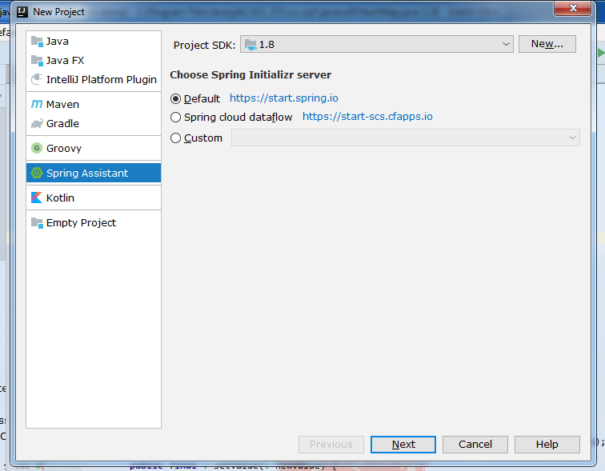

# 构建一个*SpringBoot*+*mybatis*+*mysql*的demo

## 1. 构建一个*SpringBoot*项目


## 2. 引入mysql和mybatis的依赖(mysql和mybatis依赖的版本号已在根pom.xml声明)
```xml
<dependency>
    <groupId>mysql</groupId>
    <artifactId>mysql-connector-java</artifactId>
</dependency>

<dependency>
    <groupId>org.mybatis.spring.boot</groupId>
    <artifactId>mybatis-spring-boot-starter</artifactId>
</dependency>
```
## 3. 在applicaiton.yml配置mysql数据库信息
```yaml
spring:
  datasource:
    username: root
    password: password
    url: jdbc:mysql://localhost:3306/allen
    driver-class-name: com.mysql.cj.jdbc.Driver
    # 下面的配置是为了在项目启动时执行初始化sql脚本
    continue-on-error: true
    initialization-mode: always
    platform: mysql
    # 执行初始化脚本所在路径
    schema: classpath:schema.sql
    schema-username: root
    schema-password: password
```
## 4. 编写Mapper,例子中使用了注解方式
```java
@Mapper
public interface UserMapper {

    @Select("SELECT * FROM USER_TAB WHERE NAME = #{name}")
    User findByName(@Param("name") String name);

    @Insert("INSERT INTO USER_TAB(NAME, AGE) VALUES(#{name}, #{age})")
    int insert(@Param("name") String name, @Param("age") Integer age);

    @Update("UPDATE USER_TAB SET NAME = #{name} ,AGE = #{age} WHERE ID = #{id}")
    int updateUserById(@Param("id") Long id, @Param("name") String name, @Param("age") Integer age);

    @Delete("DELETE FROM USER_TAB WHERE ID = #{id}")
    int deleteUserById(@Param("id") Long id);
}
```

## 5. 对应的有4个rest接口，springboot启动后可直接访问

- 新增User：
```
curl -X POST -H 'Content-Type: application/json' -i http://localhost:8003/users --data '{
"name":"wangwu",
"age":14
}'
```
- 根据name查询User
```
curl -X GET -i 'http://localhost:8003/users?name=wangwu'
```
- 根据id更新User
```
curl -X PUT -H 'Content-Type: application/json' -i http://localhost:8003/users --data '{
"id":1,
"name":"wangwu",
"age":15
}'
```
- 根据id删除User
```
curl -X DELETE -i 'http://localhost:8003/users?id=1'
```