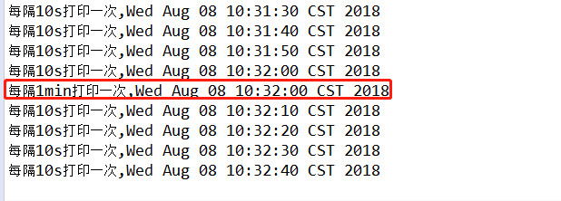

# Spring Boot 集成 Schedule
* 常用的定时器有JDK自带的Timer,可以让程序在某一频率执行,缺点是不能指定执行时间
* Spring 3以后出现的Task:大部分情况下都可以使用,日常项目中较多采用,缺点是集群环境下会出现重复执行Task
* Quartz: Quartz是OpenSymphony开源组织在Job scheduling领域又一个开源项目,多用于复杂集群环境下的任务调度,缺点是配置稍显复杂。
> 本文主要介绍Spring Task和Spring Boot项目的集成
## 1 新建一个Spring Boot项目,`pom.xml`包括`spring-boot-starter-web`即可
## 2 新建一个  `ScheduleConfig`,添加`@Configuration`和`@EnableScheduling`,这样基本的配置就结束了。

    @Configuration
    @EnableScheduling
    public class ScheduleConfig {
    
    }
## 3 在项目中使用定时器

    @Configuration
    @EnableScheduling
    public class ScheduleConfig {

        //每隔10s执行一次
        @Scheduled(cron="0/10 * * * * *")
        public void test1() {
            System.out.println("每隔10s打印一次,"+new Date());
        }
        //每隔1min执行一次
        @Scheduled(cron="0 0/1 * * * *")
        public void test2() {
            System.out.println("每隔1min打印一次,"+new Date());
        }
    
    }
> 启动Spring Boot效果如下图所示

## 4 FAQ
* 上图中出现的定时任务执行时间是根据当前服务器系统时间进行计算的，